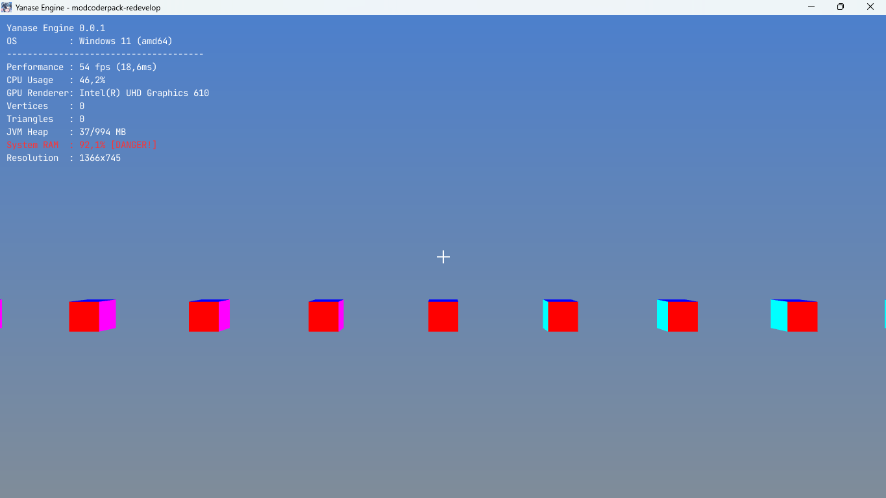

# Yanase Engine (v0.0.1)
**Yanase Engine** is a 3D Game Engine development project built from scratch using Java and the **LWJGL (Lightweight Java Game Library)**. The project focuses on understanding the core architectural components of a rendering engine, from low-level memory management to high-level scene graph organization.

---

## 🚀 Current Features (Milestones)
* **3D Scene Graph:** Hierarchical object management system (`BaseNode`, `SceneRoot`) allowing for parent-child spatial transformations.
* **Camera System:** Support for multiple camera modes (Player/Freecam) with customizable Projection and View matrices.
* **Input Management:** Comprehensive keyboard and mouse callback system, including cursor locking/unlocking for UI interaction.
* **GUI & HUD:** Real-time Debug Overlay displaying FPS, RAM usage, Coordinates, and Vertex counts.
* **Engine Settings:** Centralized configuration system (VSync, MSAA, Resolution) and UI Overlay states.
* **Raycasting:** Built-in Ray-casting support for 3D world interaction and object selection.

---

## 🛠️ Tech Stack
* **Language:** Java
* **Graphics API:** OpenGL (via LWJGL)
* **Mathematics:** JOML (Java OpenGL Math Library)
* **Image Loading:** STB Image

---
## ⚠️ Project Status: Emergency Standby / Hardware Safety
The project has reached a critical halt due to severe hardware limitations and safety concerns on the development host PC.

**Host PC Critical Status:**
* **Storage Exhaustion:** Host System Disk (C:) has dropped below 200MB, causing OS instability and failure to manage swap files.
* **Thermal & Hardware Stress:** Over-utilization of integrated GPU (Intel UHD 610) has led to thermal throttling and persistent system-level interrupts (hardware beeping).
* **VRAM/RAM Crisis:** Continuous memory pressure (stuck at 96%+) has compromised the stability of the development environment.

**Reason for Halt:**
To prevent permanent hardware damage and data loss, all development activities on this machine are suspended. The project will remain in "Read-Only" mode on GitHub until a more capable and stable development environment is secured.

**Technical Debt to Address:**
* **Font Atlas Migration:** Implementation of a Glyph-based Atlas to replace the current "Texture-per-string" logic, reducing VRAM footprint by 99%.
* **Resource Cleanup:** Enforcing strict `glDeleteTextures` and `glDeleteBuffers` protocols to prevent future memory leaks.

---

## 📸 Screenshots

---

## 👨‍💻 Author
Developed by **pmgdev64** (PMG Team).
